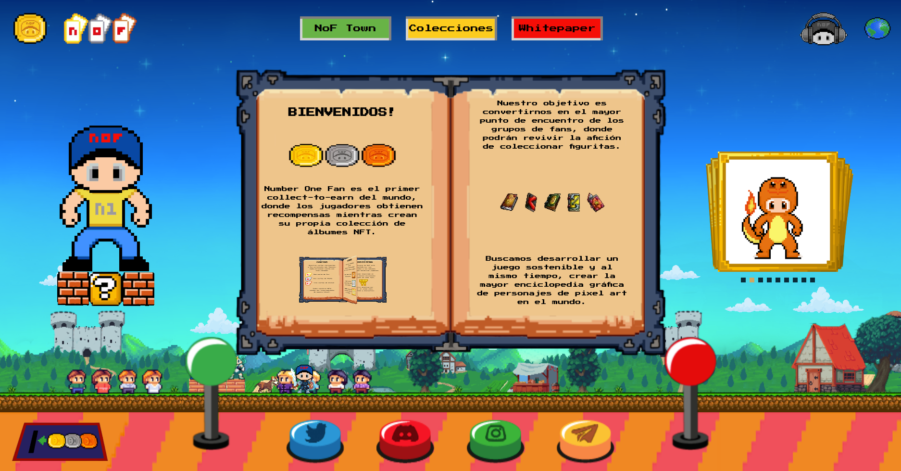

# Number One Fun (NoF)



# Build With

- [nextJs Framework](https://nextjs.org/)

# Live Demo

- [NoF Live Demo](https://nof.town)

# Requirements

## Software

This App requires:

- [nvm](https://github.com/nvm-sh/nvm) (allows you to quickly install and use different versions of node via the command line.)
- node js & npm (insalled with nvm)
- [mongo db](https://www.mongodb.com/docs/manual/installation/) (It will be used for endpoints that are consumed from the discord bot)
- [metamask](https://metamask.io/download/)

## Environment variables

Create a .env file running the command in terminal

```sh
touch .env
```

The environment variables bellow needs to be set in the .env file when project is running locally:

```sh
SKIP_PREFLIGHT_CHECK=true
GENERATE_SOURCEMAP=false
npm_config_user_agent=yarn
PORT=3000

# server-side
MONGODB='mongodb://localhost:27017'
NODE_ENV='development'
APP_ENV='development'
GAMMA_SERVICE_URL='https://gamma-microservice-7bteynlhua-uc.a.run.app'
GRAPH_URL='https://api.thegraph.com/subgraphs/name/tomasfrancizco/nof_polygon'

# Client-side
NEXT_PUBLIC_STORAGE_URL_ALPHA='https://storage.googleapis.com/nof-alpha'
NEXT_PUBLIC_STORAGE_URL_GAMMA='https://storage.googleapis.com/nof-gamma'
NEXT_PUBLIC_WALLET_CONNECT_PROJECT_ID={you project ID from walletconnect.com}
NEXT_PUBLIC_CHAIN_NAME='mumbai'
NEXT_PUBLIC_CHAIN_ID='0x13881'
NEXT_PUBLIC_CHAIN_CURRENCY='MATIC'
NEXT_PUBLIC_CHAIN_RPC_URL='https://rpc-mumbai.maticvigil.com'
NEXT_PUBLIC_CHAIN_EXPLORER_URL='https://mumbai.polygonscan.com'
NEXT_PUBLIC_DAI_ADDRESS=''
NEXT_PUBLIC_ALPHA_ADDRESS=''
NEXT_PUBLIC_GAMMA_PACKS_ADDRESS=''
NEXT_PUBLIC_GAMMA_CARDS_ADDRESS=''
NEXT_PUBLIC_GAMMA_OFFERS_ADDRESS=''
NEXT_PUBLIC_GAMMA_TICKETS_ADDRESS=''
NEXT_PUBLIC_ADMIN_ACCOUNTS='0x35dad65F60c1A32c9895BE97f6bcE57D32792E83,0xf39Fd6e51aad88F6F4ce6aB8827279cffFb92266'
NEXT_PUBLIC_CHAIN_NODE_PROVIDER_URL='https://polygon-mumbai.g.alchemy.com/v2/YOUR_API_KEY'

```

The source code of the smart contracts is located at [https://github.com/P4-Games/NoF-Smart-Contracts](https://github.com/P4-Games/NoF-Smart-Contracts). If you want to run them locally (example: on a hardhat or ganache node), after compiling them locally, change the addresses in the .env and set these options to network:

```sh
NEXT_PUBLIC_CHAIN_NAME='localhost'
NEXT_PUBLIC_CHAIN_ID='0x539'
NEXT_PUBLIC_CHAIN_CURRENCY='ETH'
NEXT_PUBLIC_CHAIN_RPC_URL='http://localhost:8545'
```

## Quick commands

### Install dependencies

```sh
- yarn install # with yarn
- npm i # with NPM
```

If you have troubles with dependencies, try this:

```sh
set http_proxy=
set https_proxy=
npm config rm https-proxy
npm config rm proxy
npm config set registry "https://registry.npmjs.org"
yarn cache clean
yarn config delete proxy
yarn --network-timeout 100000
```

### Run App

```sh
npm run dev / yarn dev
```

### Use App

```sh
Open browser in http://localhost:3000/
```

### Mock Data

You can load mock data from the alpha, gamma collections and have DAIs in your wallet in a local environment, with these commands:

```sh
# go to the root of the NoF-smart-contracts project and run
npx hardhat node # to raise the hardhat node
yarn deploy-mock-data # run the mock data

# Then upload the hardhat addresses to your wallets
```

## Contribution

### Commit changes

The application uses a linter for commit messages, requiring them to be specified in the following format:

```
- [type] message
- [type] :icono: message
```

Example:

```
- commit -m [chore] add commitlinter
- commit -m [chore] :sparkles: add commitlinter (to commit with an icon, you can use [gitmoji](https://gitmoji.dev/))
```

The allowed standard types are:

```
- feat: A new feature for the user.
- fix: Fixes a bug that affects the user.
- perf: Changes that improve site performance.
- build: Changes in the build system, deployment tasks, or installation.
- ci: Changes in continuous integration.
- docs: Changes in documentation.
- refactor: Code refactoring such as variable or function name changes.
- style: Changes in formatting, tabs, spaces, or semicolons, etc.; do not affect the user.
- test: Adds tests or refactors an existing one.
- chore: Other changes that don't modify src or test files.
- revert: Reverts a previous commit.
```

Failing to comply with these standards will cause the pre-commit to fail. To remove the last commit (without losing changes), run:

```sh
git reset --soft HEAD~1
```

For more information, refer to: [commitlint](https://commitlint.js.org/#/).
